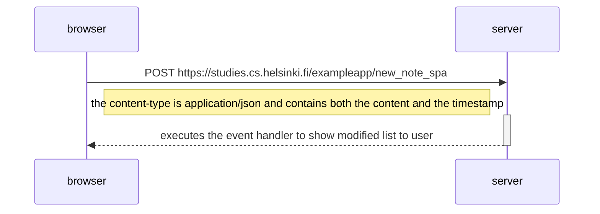

```mermaid
sequenceDiagram
  participant browser
  participant server
  
  browser->>server: POST https://studies.cs.helsinki.fi/exampleapp/new_note_spa
  
  Note right of browser: the content-type is application/json and contains both the content and the timestamp
  
  activate server
  server-->>browser: executes the event handler to show modified list to user
  deactivate server
```
